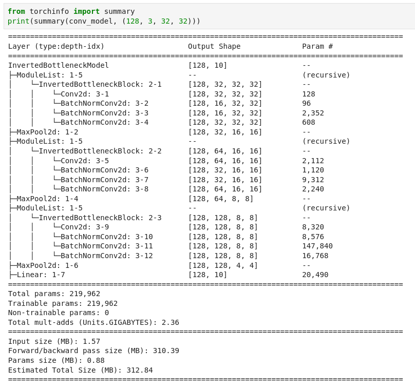
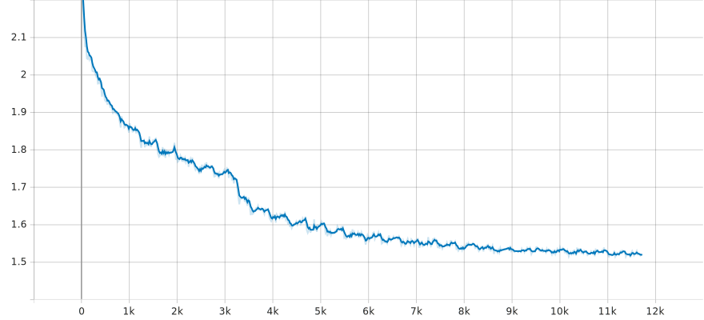
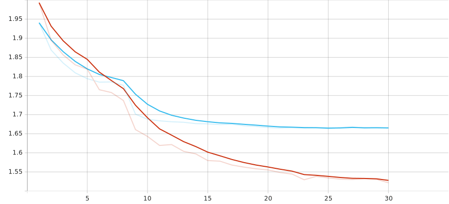

# Stacked Inverted Bottleneck layered CNN (MobileNet architecture)

This repository contains an implementation of a CNN model using a similar MobileNet architecture  

Since I haven't messed around with the hyperparameters enough, the best model currently starts overfitting at around 15 epochs which isn't too bad far a smaller model but could definetly be improved with some better data preprocessing.  

# Installation

```bash
pip install -r requirements.txt
```

Since this is a notebook, I advise you install a jupyter lab server on your own (https://jupyterlab.readthedocs.io/en/stable/getting_started/installation.html)

# Results
The training and testing is done in a single function `train_and_validation_loop` with the given number of epochs, device to run on and log writer for Tensorboard display.  
The best models (with lowering evaluation loss) are saved in the `saved_models` dir and Tensorboard logs are stored in the `runs` dir.  
Currently the model achieves around ~76% accuracy without too much overfitting.

What is nice with this architecture is obviously the reduced number of parameters, which is ideal for smaller models needing to run on mobile systems (about only a third of the number of trainable parameters than with the original bottleneck architecture using the same input data !)
  
Model paramters:

  
---
  
Training Loss:

  
---
  
Train VS Validation loss:

  
# Notes
Since I haven't tested this notebook much, some variables like local paths may need to be changed to accomodate your needs.
